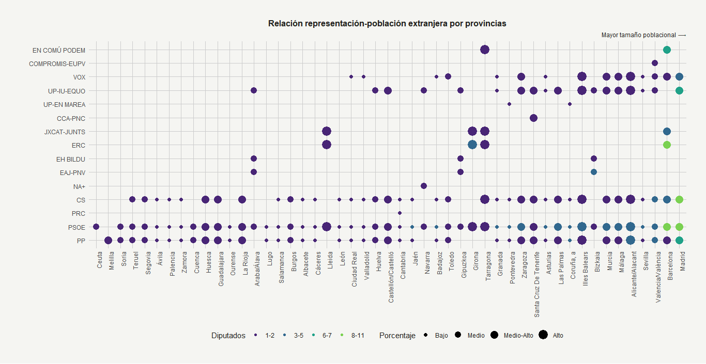
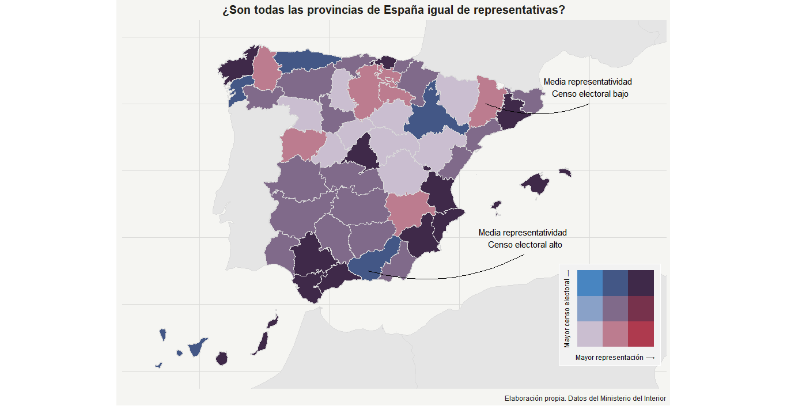

```{r setup, include=FALSE}
knitr::opts_chunk$set(echo = TRUE, eval = TRUE, message = FALSE, warning = FALSE, 
                      cache = FALSE, cache.path = "/caches/", comment = "#>",
                      collapse = TRUE,  fig.show = "hold",
                      out.width = "100%", fig.align = "center")

options(encoding = 'UTF-8')
```


## Introducción {.tabset}

### Objetivos

El objetivo de este trabajo es analizar de una forma más visual tres aspectos que consideramos curiosos de las pasadas elecciones del 28A. Nuestra primera intención es observar si los titulares de los medios de comunicación sobre la irrupción de VOX, especialmente en los municipios com mayor proporción de población extranjera, son ciertos. En el siguiente apartado veremos el coste que tiene para cada partido obtener representación en el Congreso de los Diputados. Finalizaremos con un análisis sobre las diferencias entre dos partidos nacionalistas: Compromis y ERC. Las diferencia en la propensión al voto y otros aspectos.

### Fuente de los datos

Los datos utilizados provienen del [Ministerio del Interior](http://www.infoelectoral.mir.es/infoelectoral/min/areaDescarga.html?method=inicio) y del Instituto Nacional de Estadística. A continuación importamos los datos que previamente y tal y como se muestra en el apéndice técnico hemos hecho tidy. La fuentes de los datos (el MIR) presenta unos datos que son visualmente validos pero que a efectos de tratamiento no nos sirven. En el apéndice técnico se explica detalladamente el proceso llevado a cabo.

### Aspectos previos

Primeros importamos las librerias básicas, utilizamos más librerias pero las llamamos cuando las necesitamos. Les remito al `sessionInfo()` para ver todos los paquetes utilizados.

```{r library_setup}

library(tidyverse)
library(sf)
library(LAU2boundaries4spain)
library(viridis)

# cargamos todas las funciones muy últiles para el dearrollo del trabajo, elaboradas por nosotros
source("funciones.R")

```

Cargamos los datos que hemos hecho tidy previamente. Los datos originales se encuentran en la carpeta `data/raw`. A continuación le aplicamos la función `partidosNom()` para limpiar el nombre de los partidos y reducir en algunos casos su extensión.

```{r df_base}
# Cargamos df de las elecciones y limpiamos los nombre de los partidos
generales28A <- rio::import(here::here("./data/", "generales28A.rdata")) %>% partidosNom(.)
municipios28A <- rio::import(here::here("./data/", "municipios28A.rdata")) %>% partidosNom(.)
CCAAProvCodigos <- rio::import(here::here("./data/", "CCAAProvCodigos.rdata")) # With leading 0s
```


## Sobre Vox y los medios de comunicación

Los medios de comunicación han jugado con los datos para mostrar que existia una correlación entre el voto a VOX y la inmigración. Es cierto que ha ganado en municipios con tasa de inmigración altas como El Ejido pero el número total de municipios es insignificante y destaca lo pequeños que son los municipios. Estableceremos una correleación que, a nuestro juicio, es más acertada.

Nos hemos centrado en los datos del INE de 2019 sobre las estadísticas del Padrón Continuo sobre el porcentaje de población inmigrante. Según la hipótesis de los medios de comunicación, el partido Vox saldría con mayor representación en aquellos lugares del Estado donde el porcentaje de población extranjera es más alto.

Como podemos observar, en los municipios en los que ha ganado VOX son:

```{r vox_predf}
# Importamos los datos que previamente hemos limpiado para todo el supuesto

pobExtEscanos <- rio::import("./data/poblacion_Extranjera.rdata")
pobExt <- rio::import("./data/poblacionExtranjera.rdata")

```


```{r vox_g1, eval=TRUE, include=TRUE}
VOX28A <- municipios28A %>% group_by(comunidad, codigo.prov, codigo.muni) %>% top_n(1,votos) %>%
    filter(partido == "VOX") %>% ungroup() %>% group_by(codigo.prov) %>% 
  mutate(total.votos = sum(votos), total.muni = n()) %>%
    ungroup() %>%  distinct(provincia, total.muni, total.votos)

# con trimws quitamos los espacios en blanco que parece que no están pero sí y fastidian el gráfico
VOX28A$provincia <- VOX28A$provincia %>% gsub("Castellón / ", "", .) %>% gsub("Valencia / ", "", .)

ggplot(VOX28A, aes(forcats::fct_reorder(provincia, total.muni), total.muni)) + 
  geom_col(aes(fill = total.votos)) +
    geom_text(aes(label = total.votos), nudge_y = 2,  size=3) +
    scale_fill_viridis_c(option = "magma", name = "Votos", alpha = 0.8, begin = 0.3, end = 0.7, direction = 1,
                         guide = guide_colorbar( direction = "horizontal", barheight = unit(2, units = "mm"), 
                                                 barwidth = unit(50, units = "mm"), draw.ulim = F, 
                                                 title.position = 'top', title.hjust = 0.5, label.hjust = 0.5
                         )) +
    theme_plot() + theme(legend.text = element_text(size = 8)) +
    labs(title = "Provincias en las que Vox ha sido la fuerza más votada",
         subtitle = "Número total de municipios por provincias",
         caption = default_caption) + theme(axis.title.y = element_blank())
```


Es curioso como ha ganado con a penas un puñado de votos. Por ejemplo, en Soria ha sido la fuerza más votada en cinco municipios obteniendo un global de 50 votos. La provincia más destaca es Almería que ha ganado en tres municipios pero ha obtenido un número de votos exagerado. Como decíamos anteriomente, el lugar más destacada es El Ejido que es uno de los municipios con mayor porcentaje de población inmigrante.

Exceptuando Madrid, la mayor parte son provincias del interior de España. ¿Pero son estas las que tienen un mayor porcentaje de población extranejera?

```{r, include=TRUE, eval=TRUE}
prov_inmi <- pobExt %>% top_n(14, porcentaje) 

library(treemapify)
ggplot(prov_inmi, aes(area = porcentaje, fill = porcentaje, label = provincia)) +
    geom_treemap() +
    geom_treemap_text(fontface = "italic", colour = "white", place = "centre",
                      grow = FALSE) + 
    scale_fill_viridis_c(option = "viridis", name = "", alpha = 0.8, begin = 0.3, end = 0.7, direction = 1,
                         guide = guide_colorbar( title = "Porcentaje", direction = "horizontal", barheight = unit(2, units = "mm"), 
                                                 barwidth = unit(50, units = "mm"), draw.ulim = F, 
                                                 title.position = 'top', title.hjust = 0.5, label.hjust = 0.5
                         )) + 
    theme(legend.position = "bottom") +
    labs(title = "Provincias con mayor porcentaje de población extranjera",
         caption = "Estadísticas del Padrón Continuo. 1 de Enero de 2019.")
```


La realidad es que las diez primeras provincias con mayor porcentaje de población extranjera no se corresponden con el gráfico anteriormente obtenido. Guadalajara, que antes era la primera se encuentra en la catorceava posición.  Por otro lado, es especialmente relevante el caso de Girona, ya que siendo una de las provincias con mayor porcentaje de población extranjera, no existe ningún municipio en el que VOX obtenga representación por pequeño que sea. 

```{r, include=TRUE, eval=TRUE}
diputados28A <- pobExtEscanos %>% filter(complete.cases(.), diputados > 0) %>% mutate(dipu_quantile = cut(as.numeric(diputados), breaks = c(1,2,5,7,11), include.lowest = TRUE)) %>% 
    mutate(porc_quantile = cut(porcentaje, breaks = 4, labels = c("Bajo", "Medio", "Medio-Alto", "Alto")))

dipu_label = c("1-2", "3-5", "6-7", "8-11")

```

```{r, eval=FALSE, echo=FALSE}

ggplot(diputados28A, aes(forcats::fct_reorder(provincia, poblacion), forcats::fct_reorder(partido, poblacion))) + 
    geom_point(aes(size=porc_quantile, color = dipu_quantile)) + 
    theme_plot() + scale_x_discrete(breaks = waiver()) + 
    theme(panel.grid.major = element_line(colour = "gray80"), plot.subtitle = element_text(hjust = 1, size = "9")) +
    scale_fill_viridis_d(aesthetics = "color", direction = 1, option = "viridis", 
                         name = "Diputados", begin = 0.1, end = 0.8, label = dipu_label) +
    labs(title = "Relación representación-población extranjera por provincias",
         subtitle = "Mayor tamaño poblacional ⟶️") + ylab("") + xlab("")
```



<a href="./images/vox_plot_1.png" target="_blank">[Ampliar Imágen]</a>

El gráfico anterior muestra la representación de los partidos políticos por provincia y por porcentaje de población extrajera residente. Además, la representación política se distribuye en una escala de colores, de oscuro a claro de menor a mayor representación.
Para desmentir la idea de que Vox había ganado en provincias con un alto número de población extranjera comparamos los resultados del PSOE y PP. Concluimos que Vox ha tenido mayor representación en provincias grandes y naturalmente con mayor numero de población extranjera. Sin embargo, no se observa una correlación entre la representación y la población inmigrante —como es el caso de Ávila que como hemos podido observar anteriormente ha ganado en 9 municipios— pero si que se observa una correlación positiva entre el tamaño poblacional y la representación. 


## Sobre el coste por diputado y proporcionalidad

En este apartado vamos a valorar el coste en términos de votos que tiene un diputado por partido y provincia. 

```{r, coste_dipu_1}
costeVotos <- generales28A %>% filter(diputados > 0) %>%  mutate(coste_dipu = votos/diputados) %>% mutate(pct = coste_dipu/poblacion)
costeVotos$partido <- as.factor(costeVotos$partido)

df3 <- costeVotos %>% group_by(partido) %>% top_n(1, coste_dipu) %>% ungroup()
df3$partido  <- forcats::fct_reorder(df3$partido , df3$coste_dipu)
p <- ggplot(df3, aes(partido, coste_dipu)) + geom_col(aes(fill = provincia)) + 
    theme_plot() + theme(legend.text = element_text(size=8), legend.position = "bottom") +
    scale_fill_viridis_d(option="magma", alpha = 0.8, begin = 0, end = 1, 
                         name = "", guide = guide_legend(nrow = 3, ncol = 4)) + 
    labs(title = "Provincia con el coste por diputados mas alto para cada partido") + ylab("")

plotly::ggplotly(p)
```


El diputado más costoso en términos de votos es el del PP por la provincia de Barcelona. 

Lo relevante de este gráfico, podría ser que las únicas provincias donde es más costoso obtener un diputado en términos absolutos son provincias grandes y económicamente potentes, lo que nos da una primera visión del porqué los partidos grandes en sus campañas electorales centran su atención en provincias pequeñas donde se reparten mayor número de diputados en relación a la población.

```{r, coste_dipu_2}
        costeVotos$codigo.prov <- as.numeric(costeVotos$codigo.prov)
df4 <- costeVotos %>% filter(codigo.prov %in% c(17,25,43,1,20,48, 2, 13, 16, 19, 45, 8))

ggplot(df4, aes(forcats::fct_reorder(provincia, coste_dipu), coste_dipu/1000, fill=factor(partido))) + geom_col(stat = "identity", position = position_dodge()) + 
    theme_plot_facet() + 
    facet_grid(~comunidad, scales = "free", space = "free") + scale_fill_viridis_d(option="magma", alpha = 0.8, begin = 0.1, end = 0.9, name = "") +
    labs(title = "Votos necesarios para obtener un diputado",
         caption = default_caption)+
    ylab("Miles de personas") + xlab("")
```


Por otro lado, como hemos comentado, las provincias de la España interior tienen un coste por diputado en términos absolutos menor. En comunidades autónomas como Cataluña y País Vasco, donde hay provincias tanto industrializadas como rurales, se observa una notable diferencia en el coste por diputado. 

Centrándonos en el caso de EH-Bildu, si lo comparamos con el interior de la comunidad, se observa la gran diferencia entre lo que le cuesta obtener un diputado en la provincia de Álava y lo que le cuesta en la provincia de Bizkaia que es sin lugar a dudas una región con más desarrollo económico. 

Para el caso de Castilla-La Mancha, es destacable como el coste de diputados en promedio es realmente más bajo en comparación con las otras dos CCAA. 

```{r, coste_dipu_3}
ggplot(df4, aes(forcats::fct_reorder(provincia, coste_dipu), pct, fill=factor(partido))) + geom_col(stat = "identity", position = position_dodge()) + 
    theme_plot_facet() + scale_y_continuous(labels = scales::percent) +
    facet_grid(~comunidad, scales = "free", space = "free") + scale_fill_viridis_d(option="magma", name = "", alpha = 0.8, begin = 0.1, end = 0.9) +
    labs(title = "Importancia relativa de un voto para la obtención de un diputado",
         subtitle = "A mayor porcentaje, más 'valor' tiene el voto del ciudadano", 
         caption = default_caption) +
    ylab("Cuánto representa el coste \n por diputado sobre la población") + xlab("")
```


Este grafico destaca la gran diferencia que supone el valor de un voto en Castilla-La Mancha, en general, respecto a la provincia de Barcelona, donde el valor del voto por persona es mínimo debido al gran número de habitantes que posee.

```{r, eval=FALSE, echo=FALSE}
votosRelacion <- generales28A %>% group_by(codigo.prov) %>%
    filter(diputados > 0) %>%
    mutate(total.diputados = sum(diputados, na.rm=TRUE)) %>% 
    top_n(1, votos) %>% ungroup()
 
votantes28A <- rio::import("./data/generales28ATipoVoto.rdata") %>% filter(tipo.voto == "total.censo.electoral")

votosRelacion <- left_join(votosRelacion, votantes28A)

rm("votantes28A")

votosRelacion <- votosRelacion %>% mutate(diputados_quantile = cut(total.diputados, breaks = c(1,3,8,40), include.lowest = TRUE, labels = c(1,2,3)),
                                              total.votantes_quantile = ntile(tipo.voto.num, 3),
                                  group = paste(diputados_quantile, total.votantes_quantile, sep = " - "))
unique(votosRelacion$group)

bivariate_color_scale <- tibble(
    "3 - 3" = "#3F2949", # high, high #3F2949
    "2 - 3" = "#435786", # medium, high
    "1 - 3" = "#4885C1", # low, high
    "3 - 2" = "#77324C", # high, medium
    "2 - 2" = "#806A8A", # medium, medium #806A8A
    "1 - 2" = "#89A1C8", # low, medium
    "3 - 1" = "#AE3A4E", # high, low
    "2 - 1" = "#BC7C8F", # medium, low
    "1 - 1" = "#CABED0" # low , low #CABED0
) %>%
    gather("group", "fill")

votosRelacion <- left_join(votosRelacion, bivariate_color_scale)

votosRelacion_map <- left_join(votosRelacion, loadGeometry(2))

boundariesShape <- rnaturalearth::ne_countries(scale = "medium", returnclass = "sf") %>% 
    filter(adm0_a3 %in% c("FRA", "PRT", "MAR", "ITA", "DZA"))

plot <- ggplot(votosRelacion_map) + geom_sf(data=boundariesShape, color = "gray85") + 
    geom_sf(aes(geometry = geometry, fill=fill), show.legend = FALSE, color = "gray85") + 
    annotate("text", label="Media representatividad \n Censo electoral bajo", x=5, y=42.5) +
    annotate("text", label="Media representatividad \n Censo electoral alto", x=2.5, y=38) +
    geom_curve(aes(x = 1, y = 42, xend = 5, yend = 42), curvature = 0.2) +
    geom_curve(aes(x = -3.5, y = 37, xend = 2.5, yend = 37.5), curvature = 0.2) +
    scale_fill_identity() + coord_sf(xlim = c(-12,7), ylim = c(34,44)) +
    labs(title = "¿Son todas las provincias de España igual de representativas?",
         caption = default_caption) + theme_map()

# Draw the legend
bivariate_color_scale <- bivariate_color_scale %>%
    separate(group, into = c("diputados", "votantes"), sep = " - ") %>%
    mutate(votantes = as.factor(votantes),
           diputados = as.factor(diputados))

legend <- ggplot() +
    geom_tile(
        data = bivariate_color_scale,
        mapping = aes(
            x = diputados,
            y = votantes,
            fill = fill)
    ) +
    scale_fill_identity() +
    labs(x = "Mayor representación ->️",
         y = "Mayor censo electoral ->️") +
    # make font small enough
    theme(
        axis.title = element_text(size = 7)
    ) +
    # quadratic tiles
    coord_fixed() +
    theme(axis.text = element_blank(),
          plot.background = element_rect(fill = "gray95"),
          panel.background = element_rect(fill = "gray95"),
          panel.grid.major = element_line(color = "gray95"),
          axis.ticks = element_blank())


library(cowplot)
ggdraw() +
    draw_plot(plot, 0, 0, 1, 1) +
    draw_plot(legend, 0.65, 0.15, 0.25, 0.25)

# no vamos a incluir el grafico que sale de este código porque no termina de quedar bien, lo hemos generado en datos.R y guardado la imagen
```




Finalmente, el mapa anterior es un mapa bivariante que muestra la relación entre la representatividad (diputados) y el total del censo electoral. Los colores que están en la linea diagonal serian aquellas provincias que están correctamente representadas. Aquellas provincias como Lleida o Lugo estarían sobrerrepresentadas, el número de diputados que reparten es proporcionalmente mayor al censo electoral. Por otro lado, Ourense o Zaragoza estarían infrarrepresentadas, en promedio los diputados que reparten son menores dado el censo electoral.


## Sobre Compromís vs. ERC   

```{r}
compromisERC <- municipios28A %>% filter(codigo.prov %in% c("03","12","46", "08","17", "43", "25"), 
                                      partido %in% c("COMPROMIS-EUPV", "ERC"),
                                      votos > 0) %>% 
                mutate(INECodMuni = paste(codigo.prov, codigo.muni, sep = ""),
                       votos_quantile = ntile(votos, 5)) 

compromisERC_mapa <- left_join(compromisERC, loadGeometry(6, provincias = c("03","12","46", "08","17", "43", "25")))

provinciasLindes <- c("22", "44", "50", "16", "44", "30", "02", "07", "31", "19")

fraSF <- rnaturalearth::ne_countries(scale = "medium", returnclass = "sf") %>% filter(adm0_a3 == "FRA")

plot1 <- ggplot() + geom_sf(data = fraSF, aes(geometry = geometry)) +
    geom_sf(aes(geometry = geometry), data=filter(loadGeometry(1, provincias = provinciasLindes))) +
    geom_sf(aes(geometry = geometry, fill=votos_quantile), data=compromisERC_mapa) +
    scale_fill_viridis(
        option = "magma", 
        direction = -1,
        begin = 0.3, end = 0.8,
        name = "Votos (Quantiles)",
        # here we use guide_colourbar because it is still a continuous scale --> https://timogrossenbacher.ch/2016/12/beautiful-thematic-maps-with-ggplot2-only/
        guide = guide_colorbar(
            direction = "horizontal",
            barheight = unit(2, units = "mm"),
            barwidth = unit(50, units = "mm"),
            draw.ulim = F,
            title.position = 'top',
            # some shifting around
            title.hjust = 0.5,
            label.hjust = 0.5
        )) +
    coord_sf(xlim = c(-1.5, 4), ylim = c(38,42.7)) + theme_map() + 
  theme(legend.position = "bottom", plot.title = element_text(size = 12) ) + 
  labs(title="Densidad de votos a Compromís y ERC", caption = default_caption)

plot1
```


En esta sección queremos comparar el origen del voto de los partidos nacionalistas Compromís y Esquerra Republicana de Cataluña (ERC). En primer lugar, lo que percibimos es que el voto de Compromís, se ubica en el territorio que ocupa las grandes ciudades de la Comunidad Valenciana mientras que el voto de ERC no sigue el mismo patrón y obtiene gran representación uniformemente por todo el territorio catalán. 
Es relevante el caso de Lleida porque como anteriormente hemos resaltado, la provincia está sobrerrepresentada en el número de diputados por lo que cada voto a ERC tiene más valor.   


```{r}
votantes28A <- rio::import("./data/generales28ATipoVoto.rdata") %>% filter(tipo.voto == "total.censo.electoral",
                                                                           codigo.prov %in% c("03","12","46", "08","17", "43", "25"))

tableCompromis <- generales28A %>% filter(partido %in% c("COMPROMIS-EUPV", "ERC"), votos > 0) %>% left_join(votantes28A) %>% 
    select(c(3,5,6,7,10))
colnames(tableCompromis) <- c("Provincia", "Partido", "Nº votos", "Diputados", "Total censo electoral")
knitr::kable(tableCompromis)    
```


La poca progresividad en la representatividad se puede observar con los resultados de Compromís en Valencia. Con 126.078 votos ha obtenido un solo diputado frente a ERC que en Lleida con menor número de votantes y censo electoral ha obtenido dos diputados. Recordamos que Compromís es el segundo partido con mayor coste en términos de votos por diputado solo por detrás del PP en Barcelona.

```{r}
edadmedia <- rio::import(here::here("data", "edadMediaPob2019.rdata")) %>% filter(codigo.prov %in% c("03","12","46", "08","17", "43", "25"))

edadmedia_map <- left_join(edadmedia, loadGeometry(6, provincias = c("03","12","46", "08","17", "43", "25")))

plot2 <- ggplot() + geom_sf(data = fraSF, aes(geometry = geometry)) +
    geom_sf(data=loadGeometry(3, provinciasLindes), aes(geometry = geometry), alpha = 0.5) +
    geom_sf(data=edadmedia_map, aes(geometry = geometry, fill = quantile)) + 
    scale_fill_viridis(
        option = "magma", 
        direction = -1,
        begin = 0.3, end = 0.8,
        name = "Edad Media",
        # here we use guide_colourbar because it is still a continuous scale --> https://timogrossenbacher.ch/2016/12/beautiful-thematic-maps-with-ggplot2-only/
        guide = guide_colorbar(
            direction = "horizontal",
            barheight = unit(2, units = "mm"),
            barwidth = unit(50, units = "mm"),
            draw.ulim = F,
            title.position = 'top',
            # some shifting around
            title.hjust = 0.5,
            label.hjust = 0.5
        )) +
    coord_sf(xlim = c(-1.5, 4), ylim = c(38,42.7)) + theme_map() + theme(legend.position = "bottom") + 
  labs(title = "Edad media por municipios",
       subtitle = "Nota: datos de INE trameados cruzados con la población",
       caption = default_caption)

gridExtra::grid.arrange(plot1, plot2, ncol=2)
```


Finalmente, resulta relevante la relacción inversa entre la propensión al voto de estas dos formaciones y la edad media de los municipios. A falta de un análisis más exhaustivo podríamos decir que el perfil del votante de las formaciones es relativamente jóven.

## Encuéntrate

```{r}
library(DT)

infovotos <- rio::import("./data/municipios28ATipoVoto.rdata") %>%  select(c(2,4,7)) %>% unique()
dtable <- municipios28A %>% filter(votos > 0) %>% left_join(., infovotos) %>% select(-c(2,4))
dtable$provincia <- chartr('áéíóúñ','aeioun', dtable$provincia)
dtable$municipio <- chartr('áéíóúñ','aeioun', dtable$municipio)
dtable$comunidad <- chartr('áéíóúñ','aeioun', dtable$comunidad)


datatable(dtable)

```

## Conclusión

Del primer supuesto concluimos que después de las elecciones del 29 de Abril, los medios han exagerado el resultado obtenido por VOX, cogiendo datos aislados buscando justificación a su titular. 

Del segundo supuesto, concluimos que el sistema de representación que existe en España es claramente poco proporcional. Algunas provincias tienen asignados mayor número de diputado respecto a su censo electora, lo que perjudica a partidos de ámbito nacional en beneficio de partidos regionalistas como Esquerra Republicana de Cataluña y EH-Bildu. 

Del tercer supuesto y en base a las investigaciones de los supuestos anteriores podemos concluir que ERC obtiene mayor representación de las provincias del interior de Cataluña debido a que algunas como Lleida estan sobrerepresentadas. EL votante de ambas formaciones serías más jóvenen. Compromis obtiene mayor reprentación de los municipios próximos a la costa y de tradición valenciano-parlante (en general) y ERC se centra también en la Cataluña más industrializada que es Barcelona y las poblaciones que lindan a la ciudad.

## Sessión

```{r}
sessionInfo()
```
 

## Apéndice Técnico

### Archivo: `preparacion_datos.R` 

Los datos están obtenidos del MIR y utilizando estas funciones los hemos preparado para su uso.
```{r }
resultadoDiputados <- function(df, rows){
    g <- df
    rows <- rows
    
    ## Generamos un df solo con los datos de las provincias y su poblacion
    pobCom <- g[5:rows, 1:4]
    colnames(pobCom)[1:4] <- c("comunidad", "codigo.prov", "provincia", "poblacion")

    
    ## Generamos un df para los votos y diputados del 
    gen <- g %>% mutate("codigo.prov" = X2 ) %>% select(-c(1, 3:16)) %>% select(c(1, length(.), 2:(length(.)-1)))
    names(gen) <- as.character(gen[3,])
    
    even_indexes<-seq(2,length(gen),2)
    odd_indexes<-seq(1,length(gen),2)
    
    diputados <- gen[,even_indexes]
    votos <- gen[,odd_indexes]
    
    diputados <- diputados[5:rows,]
    colnames(diputados) <- colnames(votos)
    diputados <- gather(diputados, partido, diputados, 2:length(diputados))
    colnames(diputados)[1] <- "codigo.prov"
    
    votos <- votos[5:rows,]
    votos <- gather(votos, partido, votos, 2:length(votos))
    colnames(votos)[1] <- "codigo.prov"
    
    diputados <- left_join(pobCom, diputados, by="codigo.prov")
    
    
    votos <- left_join(pobCom, votos, by="codigo.prov")
    votos <- filter(votos, votos > 0)
    
    # Unimos los df para crear el definitivo
    gen <- full_join(votos, diputados)
    
    gen$codigo.prov <- as.numeric(gen$codigo.prov)
    gen$codigo.prov <- sprintf("%02d", gen$codigo.prov)
    gen$provincia <- trimws(gen$provincia, "r")
    
    gen[,c(4,6,7)] <- sapply(gen[,c(4,6,7)], as.numeric)

    rm(list = c("g", "pobCom", "votos", "diputados"))
    
    return(gen)
    
}

resultadoDiputadosTipoVotos <- function(df, rows){
    g <- df
    rows <- rows
    
    ## Generamos un df solo con los datos de las provincias y su poblacion
    pobCom <- g[4:rows, 1:16]
    colnames(pobCom) <- pobCom[1,] %>% tolower(.) %>% gsub(" de ", " ", .) %>% 
        gsub(" ", ".", .) %>% chartr('áéíóúñ','aeioun', .)
    colnames(pobCom)[1:3] <- c("comunidad", "codigo.prov", "provincia")
    pobCom <- pobCom[-c(1),] %>% gather(tipo.voto, tipo.voto.num, 6:16 )
    
    pobCom$codigo.prov <- as.numeric(pobCom$codigo.prov)
    pobCom$codigo.prov <- sprintf("%02d", pobCom$codigo.prov)
    pobCom$provincia <- trimws(pobCom$provincia, "r")

    pobCom[,c(4,5,7)] <- sapply(pobCom[,c(4,5,7)], as.numeric)
    
    rm(list = c("g", "rows"))
    
    return(pobCom)
    
}
```


Estas dos funciones utlizan el paquete `TidyVerse` y por un lado `resultadosDiputados` obtiene un dataframe con el número de votos y diputados que cada formación política ha obtenido en cada comunidad. La función `resultadosDiputadosTipoVoto` crea otro dataframe partiendo del mismo archivo pero con los datos relativos al tipo de voto: CER, CERA, abtensión, valido, nulo, censo electoral etc. Debido a la ingente cantidad de datos, el archivo original lo hemos separado en dos dataframes más manejables.

```{r }
resultadoMunicipios <- function(df, rows){
    g <- df
    rows <- rows
    
    colnames(g) <- as.character(g[3,])
    # g <- janitor::clean_names(g)
    municipios <- g[4:rows,]
    municipios <- municipios %>% select(-c(7:13))
    municipios <- municipios %>% gather(partido, votos, 7:length(.))
    colnames(municipios) <- c("comunidad", "codigo.prov", "provincia", "codigo.muni", 
                              "municipio","poblacion", "partido", "votos")
    municipios$poblacion <- as.numeric(municipios$poblacion)
    municipios$votos <- as.numeric(municipios$votos)
    municipios$codigo.prov <- as.numeric(municipios$codigo.prov)
    municipios$codigo.prov <- sprintf("%02d", municipios$codigo.prov)
    municipios$codigo.muni <- as.numeric(municipios$codigo.muni)
    municipios$codigo.muni <- sprintf("%03d", municipios$codigo.muni)
    municipios$provincia <- trimws(municipios$provincia, "r")

    return(municipios)
    
    rm(list = c("g", "municipios", "rows"))
}

resultadoMunicipiosTipoVotos <- function(df, rows){
    g <- df
    rows <- rows
    
    colnames(g) <- as.character(g[3,])
    # g <- janitor::clean_names(g)
    municipios <- g[4:rows,1:13]
    municipios <- municipios %>% select(-c(7)) %>% gather(tipo.voto, tipo.voto.num, 8:length(.))
    colnames(municipios) <- c("comunidad", "codigo.prov", "provincia", "codigo.muni", 
                              "municipio","poblacion", "censo.electoral", "tipo.voto", "tipo.voto.num")
    municipios$poblacion <- as.numeric(municipios$poblacion)
    municipios$votos <- as.numeric(municipios$tipo.voto.num)
    municipios$codigo.prov <- as.numeric(municipios$codigo.prov)
    municipios$codigo.prov <- sprintf("%02d", municipios$codigo.prov)
    municipios$codigo.muni <- as.numeric(municipios$codigo.muni)
    municipios$codigo.muni <- sprintf("%03d", municipios$codigo.muni)
    municipios$provincia <- trimws(municipios$provincia, "r")
    
    return(municipios)
    
    rm(list = c("g", "municipios", "rows"))
}

```

Las funciones anteriores hacen la misma función que las descritas para los resultados generales pero estas se utilizan para los resultados municipales.

EL procedimiento para usar las funciones es el siguiente: `resultadoDiputados(dataframe, filas)`. El atributo dataframe es el conjunto de datos sobre el que trabajará y el atributo filas es el número de filas útiles ya que estos archivos contiene filas en blanco o que muestran totales. Por praticidad decidimos eliminarlas y si necesitamos los totales los calularemos insitu. Para el resto de funciones es el mismo procedimiento, la función está programa para saber que columnas tiene que utilizar.
Las funciones originales se encuentran en el archivo `preparacion_datos.R`

### Archivo: `funciones.R`

Este archivo incluye una series de funciones que nos han sido muy útiles.

```{r }
# Función para poder unir correctamente los df de los resultados con los códigos de las CCAA y provincias.

limpiarProv <- function(x){
    x <- tolower(x)
    x <- gsub(", comunidad de", "", x)
    x <- gsub(", regi\u00F3n de", "", x)
    x <- gsub(", comunidad foral de", "", x)
    x <- gsub(", principado de", "", x)
    x <- gsub("coruña, a", "A Coruña", x) 
    x <- gsub("balears, illes", "illes balears", x) 
    x <- gsub("rioja, la", "la rioja", x)
    x <- gsub("palmas, las", "las palmas", x) 
    x <- tools::toTitleCase(x)
}
```

Un poco de tunning para los mapas y graficos. Lo hacemos en una función para estandarizar el aspecto de los mapas y ahorrarnos escribir todo ese texto en cada uno de los que hemos hecho. Misma lógica para los gráficos y los gráficos con facet 

```{r, }
theme_map <- function(...) {
    theme_minimal() +
        theme(panel.grid.major = element_line(color = "#dbdbd9", size = 0.2), 
              panel.grid.minor = element_line(colour = "gray99"), 
              plot.background = element_rect(fill = "#f5f5f2", color = NA),
              panel.background = element_rect(fill = "#f5f5f2", color = NA),
              legend.background = element_rect(fill = "#f5f5f2", color = NA),
              legend.key = element_rect(fill = NA),
              legend.position = "top",
              legend.direction = "horizontal",
              axis.line = element_blank(),
              axis.text.x = element_blank(),
              axis.text.y = element_blank(),
              axis.ticks = element_blank(),
              axis.title.x = element_blank(),
              axis.title.y = element_blank(),
              text = element_text(color = "#22211d"),
              plot.title = element_text(hjust = 0.5, face = "bold", lineheight = "20px", size = "15"),
              plot.subtitle = element_text(hjust = 0.5, size = "9"))

}

theme_plot <- function(...){
    theme_minimal() +
        theme(panel.grid.major = element_line(colour = "gray99"), 
              panel.grid.minor = element_line(colour = "gray90"), 
              plot.background = element_rect(fill = "#f5f5f2", color = NA),
              panel.background = element_rect(fill = "#f5f5f2", color = NA),
              legend.background = element_rect(fill = "#f5f5f2", color = NA),
              legend.position = "bottom",
              legend.direction = "horizontal",
              axis.text.x = element_text(angle = 90, hjust = 1),
              axis.title.x = element_blank(),
              text = element_text(family = "sans", color = "#22211d"),
              plot.title = element_text(hjust = 0.5, face = "bold", lineheight = "15", size = "12"),
              plot.subtitle = element_text(hjust = 0.5, size = "9"),
              plot.margin = margin(1, 1, 1, 1, "cm"))
}

theme_plot_facet <- function(...){
        theme(panel.grid.major = element_line(colour = "gray99"), 
              panel.grid.minor = element_line(colour = "gray90"), 
              plot.background = element_rect(fill = "#f5f5f2", color = NA),
              panel.background = element_rect(fill = "#f5f5f2", color = NA),
              legend.background = element_rect(fill = "#f5f5f2", color = NA),
              legend.position = "bottom",
              legend.direction = "horizontal",
              axis.text.x = element_text(angle = 90, hjust = 1),
              axis.title.x = element_blank(),
              text = element_text(family = "sans", color = "#22211d"),
              plot.title = element_text(hjust = 0.5, face = "bold", lineheight = "15", size = "12"),
              plot.subtitle = element_text(hjust = 0.5, size = "9"),
              plot.margin = margin(1, 1, 1, 1, "cm"))
}

default_caption <- "Elaboraci\u00F3n propia. Datos del Ministerio del Interior"
```

Función para cargar geometrias. Muy útil, tiene varios modos descritos posteriormente y que cargan las geometrias de España según nuestros criterios. Basado en el paquete `LAU2boundaries4spain` disponible en Github. `loadGeometry(modo, provincias, municipios)`. `provincias` y `municipios` lo utilzaremos por si queremos obtener geoetrias concretas. Modos
- 1: Solo península y baleares
- 2: península, baleares y canarias
- 3: filtrar provincias con su código
- 4: municipios (2018)
- 5: filtrar municipios por código de municipios del INE
- 6: filtrar municipios por código de provincia


```{r, }
## Cargar geometria
# 1: solo peninsula, 2: canarias + peninsula, 3: provincias por codigo, 4: municipios 2018, 5-6: filtro municipios 2018
loadGeometry <- function(mode = 1, provincias = NULL, municipios = NULL){

    library(sf)
    library(LAU2boundaries4spain)
    # library(tidyverse)
    
    if(mode==1){
        peninsula <- Provincias %>% filter( !(INECodProv %in% c(35, 38)) )
        colnames(peninsula)[1] <- c("codigo.prov")
        return(peninsula)
    }
    
    if(mode==2){
        # https://github.com/perezp44/LAU2boundaries4spain
        canarias <- Provincias %>% filter(INECodProv %in% c(35,38))
        peninsula <- Provincias %>% filter( !(INECodProv %in% c(35, 38)) )
        my_shift <- st_bbox(peninsula)[c(1,2)]- (st_bbox(canarias)[c(1,2)]) + c(-2.4, -1.1)
        canarias$geometry <- canarias$geometry + my_shift
        st_crs(canarias)  <- st_crs(peninsula)
        peninsula_a <- rbind(peninsula, canarias)
        colnames(peninsula_a)[1] <- c("codigo.prov")
        return(peninsula_a)
    }
    
    if(mode==3){
        
        x <- Provincias %>% filter(INECodProv %in% provincias)
        colnames(x)[1] <- c("codigo.prov")
        return(x)
    }
    
    if(mode==4){
        x <- municipios_2018
        return(x)
    }
    
    if(mode==5){
        x <- municipios_2018 %>% filter(INECodMuni %in% municipios)
        return(x)
    }
    if(mode==6){
        x <- municipios_2018 %>% filter(INECodProv %in% provincias)
        return(x)
    }

}


```


